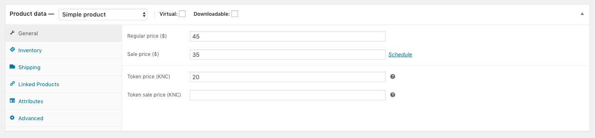
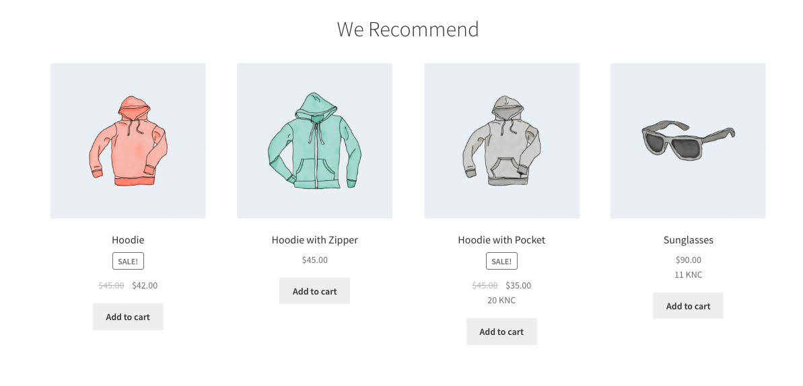
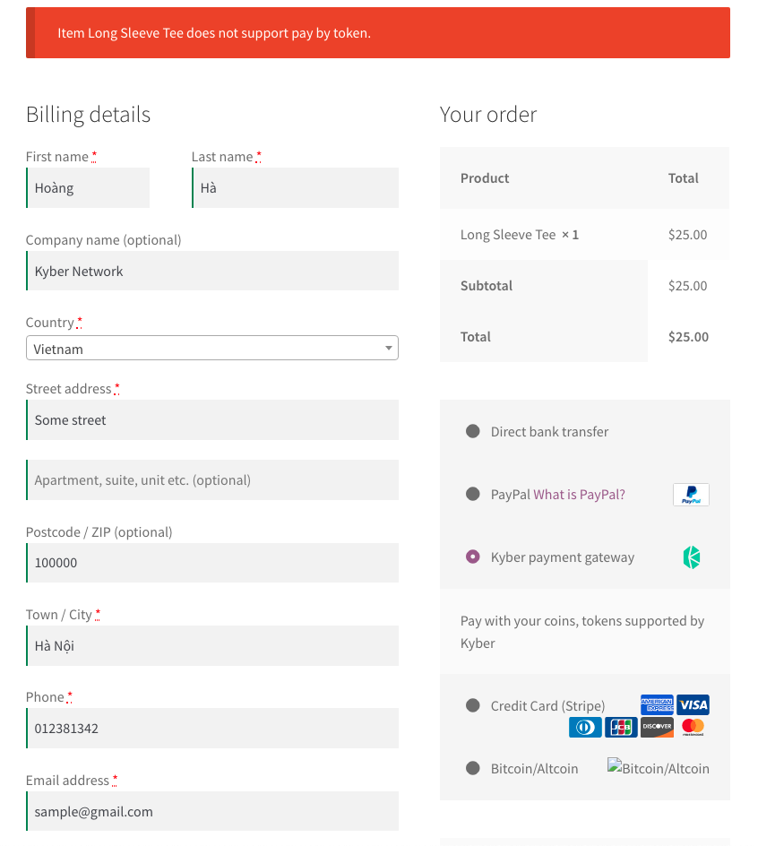
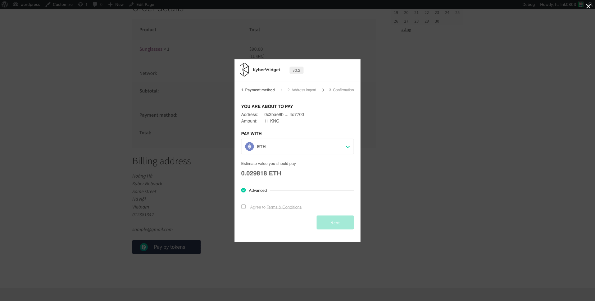
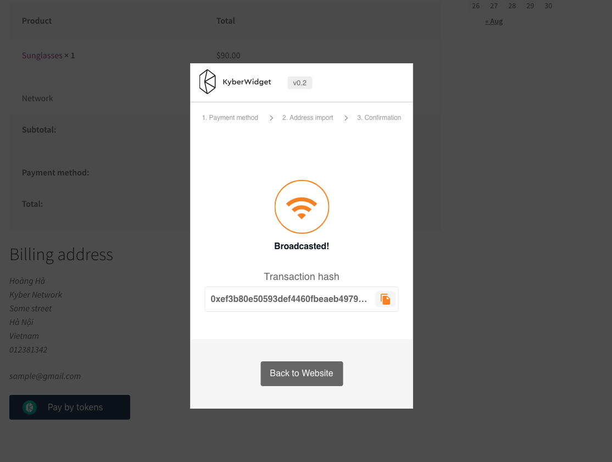
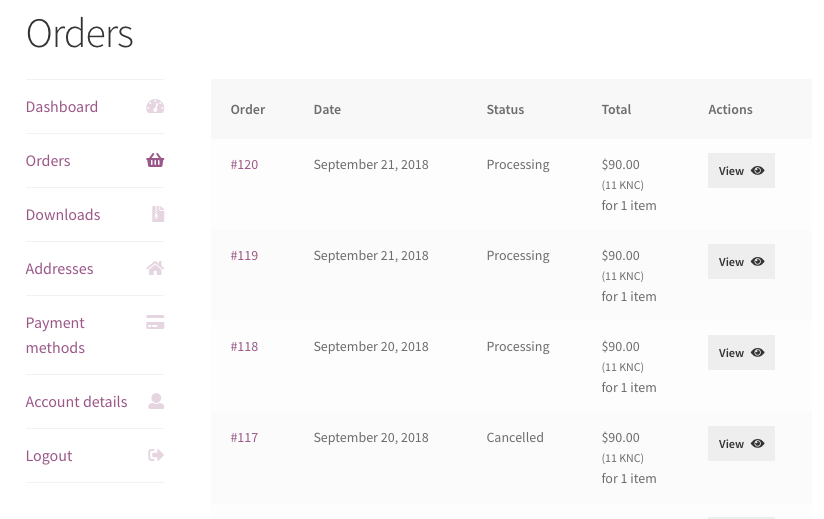

# Sample walkthrough

**Required**

- *[Woocommerce](https://github.com/woocommerce/woocommerce)*

This plugin allow a website e-commerce using Woocommerce to accept payment by coins/token

Below is a sample steps to use this plugins.

1. Plugin settings

2. Set item price
   

3. Item price will be display under the fiat price

4. Currently you can only pay the cart which all items support paid by coins/token

5. When user pays for the cart, the KyberWidget will do the rest, with the KyberWidget, user can pay by any tokens (which is supported) and you (the seller) will receive the token you want.

6. The widget will return the transaction hash for the payment, the plugin will use this tx hash for checking transaction status.

7. When the transaction succeeded, the order status will turn from **on-hold** to **processing**. At this stage, website admin will have notifications about the payment success and start processing shiping products or user can start download to virtual or downloadable products (still in progress)

8. When the transaction failed, the order status will turn from **on-hold** to **failed**

